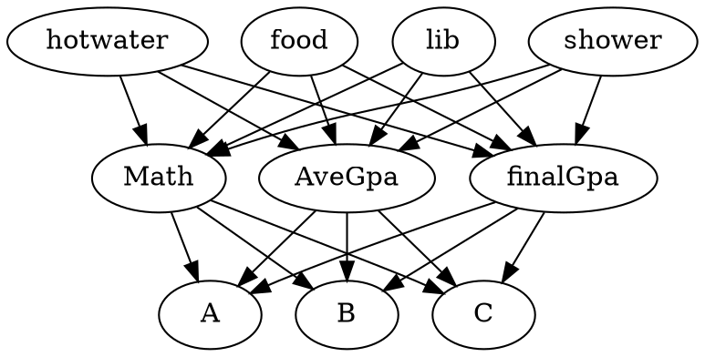

<!--
 * @Description: In User Settings Edit
 * @Author: your name
 * @Date: 2019-05-08 10:03:14
 * @LastEditTime: 2019-09-10 19:51:35
 * @LastEditors: Please set LastEditors
 -->

# 1.eduCircle 
@import 'sys.png'
### Case Study

#### Case1 
**设计**：教学楼、图书馆、食堂、宿舍四v个地点的位置移动情况。 
**结论**： T1000与B1000的学生去图书馆的很相似 ➡️  图书馆次数多并不能明显提高学生成绩

@import "case1.png"

**问题**： 刷卡数据并不是实时追踪，四个地点的移动在时间上并不连贯。

#### case2 
**设计**：日历图
**结论**： T1000的学生在考试周更倾向于去图书馆，并且在周末更倾向于图书馆。B1000的学生在一学期的开始可能就会放弃去教学楼了。B1000的学生在宿舍的行为更多，可能是喜欢宅。T1000相对来说行为少，特别是在工作日（在case图中没有看出来）

@import "case2.png"
‘
#### case3
**设计**：刷卡时间的热力Pie Chart
**结论**： T1000的学生回宿舍的时间较晚，22:00之后。

case中只用了设计中的三个视图。
Sequence View展示了一个学生的行为序列，但是在case中并没有用到这个视图。

# 2.eduExplorer
@import "eduExplorer.png"

### case
将学生分类然后进行讨论：
1. 不同成绩学生群体的行为差异（教学楼、图书馆）
**设计**：日历热力图
**结论**： T500的学生去的次数更多、T500学生考试月聚集效应
2. 不同的学生群体的严谨性差异
**设计**：时钟图、真实熵平行坐标轴图
**结论**： T500的严谨性高、T500的时钟图的峰值更明显。
3. 不同的成就性学生群体的行为差异
**设计**：时钟图、平行坐标轴图
**结论**： 成就性高的学生成绩普遍高，成就性低的学生成绩很分散。
4. 假期早起的学生
**设计**：时钟图、平行坐标轴图、热力图用作筛选
**结论**： 假期早起成绩更好

# 3.eduRedar
采用机器学习的方法，通过学生的行为，对学生的成绩进行预测进行分类。

\* GPA需要重新计算
\* 目前系统中采用的是前三学期的图书馆行为预测最后的数学平均GPA的分类情况。用于对比的是学生的真实的数数据平均GPA

 **设计 Beta0.1**：
 1. 学生成绩流动sankey图

@import "sankey.png"
 
希望看到的规律：学生几个学期的变化呈“阶级固化”。
然而由于并不理想

2. 各类学生的刷卡热力图
@import "heatmap.png"

按这一版本的系统划分出来的学生群体并没有非常好的规律性。
并且这里统计的时候时间划分不合理，导致画出来的图在期末时间段内的现象解释不了。

3. 真实GPA平行坐标轴图
@import "parallel.png"

作为展示成绩的筛选器

4. 个人行为Redar图
@import "redar2.png"
用于反映单个人一学期的刷卡行为规律。

**设计Beta0.2**
为了解决第一版设计和算法没有半毛钱关系的问题，开始了第二版的设计

1. 算法分类结果图
@import "A.png"
A
@import "B.png"
B
@import "C.png"
C
可以看出能给正确分类的大概只有50%。

2. 各类学生的三学期刷卡情况总览图
@import "records.png"
可以看到被分到同一类的学生的刷卡情况还是比较相似的。
比如被分到A类的学生都有去图书馆次数比较高的现象（有可能是因为我们的分类算法就是基于图书馆刷卡次数的）

# Next
1. 解决之前存在数据问题。
2. 数据的规律简单的统计
3. **故事**，**故事**，**故事**。相较于前两个工作，这里没有很好的故事。